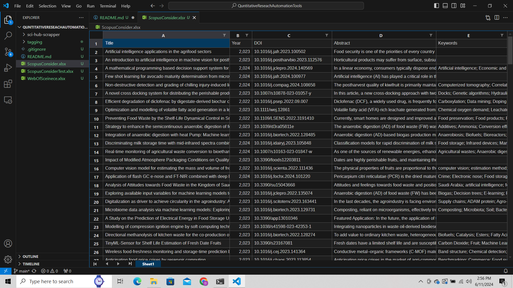
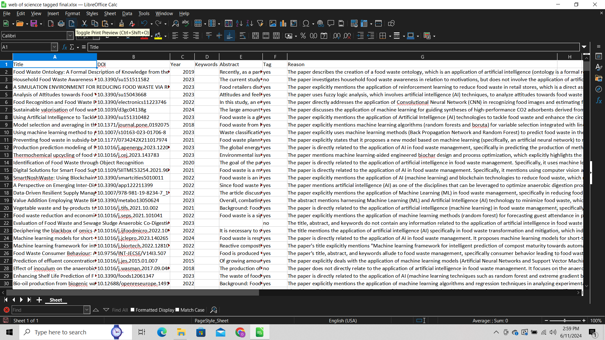

# Quantitative Research Automation Tools

***Each folder in the repository is a Python Script that automate a task***

# 1. sci-hub-scrapper
- It downloads research papers provided DOI using Selenium
- Needs a list of DOI  (xlsx file)
- Make sure chromium and required packages are installed
- For security it does not auto check for DDoS. You have to manullay prove you are a human. DON'T worry it will not ask again and again. ;)
- 

# 2. tagging
- Generative AI application
- Model Used LLama3 7B
- It takes an xlxs file having 4 columns (Title, Keywords, Year, Abstract)

- System will read the Title, Keywords, and Abstract and tag the paper as yes or no as per your topic
    - If a paper is relevant to your choosen topic it will tag yes other wise no with adding a new column tag and updates value
    - It will also give you the reason why it tagged as yes or no in new column as reasons
    - System will save the final results in results.xlxs file
- 